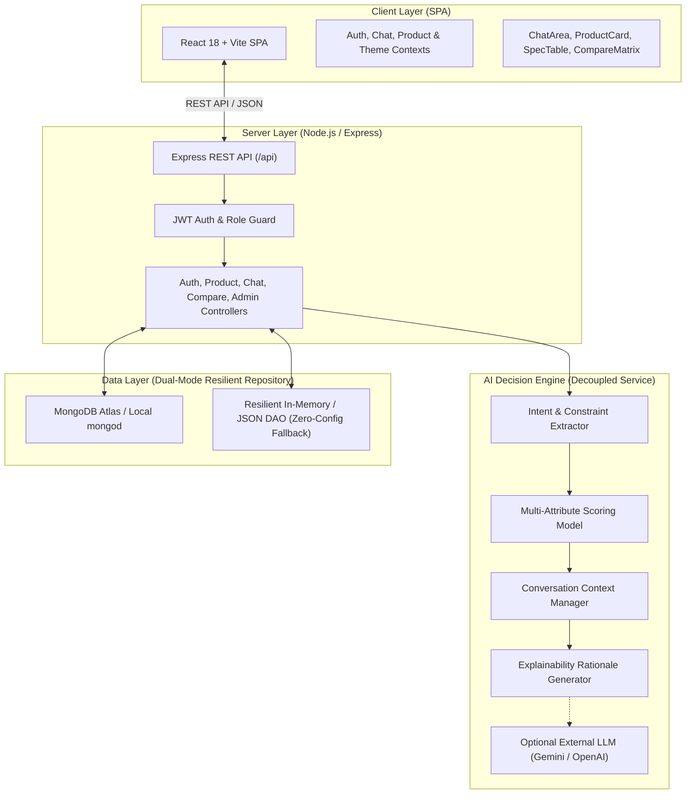

# ProductAI — Intelligent AI Product Recommendation & Shopping Assistant

> **A Major Project for B.Tech Computer Science & Engineering (4th Year / Final Year)**  
> Engineered as a production-quality, explainable AI-powered e-commerce decision support platform.

---

## 📌 1. Project Abstract & Overview

In contemporary e-commerce landscapes, users frequently suffer from **choice overload** when searching for electronic devices. Conventional search engines and e-commerce platforms rely on simplistic keyword filters that fail to capture semantic intent, nuanced hardware trade-offs, and multi-factor budget constraints (e.g., *"Suggest a laptop for coding and machine learning under ₹80,000"*).

**ProductAI** solves this problem by introducing an **Intelligent Conversational Shopping Assistant** powered by a dual-layer AI recommendation architecture:
1. **Natural Language Understanding (NLU)**: Parses unstructured human intent into structured constraints (Category, Budget limit, Target use-cases, RAM/SSD/GPU requirements).
2. **Multi-Attribute Decision Making (MADM) Scoring Model**: Evaluates candidate catalog items across 6 weighted mathematical dimensions to compute a deterministic, normalized **AI Match Score (%)**.
3. **Explainable AI (XAI)**: Generates human-readable, transparent justifications explaining *why* a particular item was recommended and what trade-offs exist.
4. **Contextual Conversation Memory**: Retains session state across conversational turns (e.g., handling follow-ups like *"What about Samsung?"* or *"Show something cheaper"*).
5. **Preference Learning**: Learns user optimization priorities (Performance, Price/Value, Battery, Gaming) to personalize future recommendations.

---

## 🏛️ 2. System Architecture



---

## 📐 3. Mathematical Formulation: Multi-Attribute Recommendation Algorithm

The recommendation engine calculates an **AI Match Score ($S_{total}$)** for each candidate product $P$ against user requirements $R$:

$$S_{total} = \left( w_{cat} S_{cat} + w_{bud} S_{bud} + w_{spec} S_{spec} + w_{use} S_{use} + w_{rat} S_{rat} + w_{val} S_{val} \right) \times M_{brand}$$

### Weight Vector ($W$):
* $w_{cat} = 0.25$ (Category Exact Match)
* $w_{bud} = 0.25$ (Budget Fit & Savings Ratio)
* $w_{spec} = 0.20$ (Hardware Specifications: RAM, Storage, GPU)
* $w_{use} = 0.15$ (Use-Case & Persona Overlap)
* $w_{rat} = 0.08$ (Normalized Customer Rating)
* $w_{val} = 0.07$ (Algorithmic Value-for-Money Index)

### Dimension Calculation:
1. **Category Score ($S_{cat}$)**:
   $$S_{cat} = \begin{cases} 1.0 & \text{if } P_{category} = R_{category} \\ 0.0 & \text{otherwise} \end{cases}$$

2. **Budget Score ($S_{bud}$)**:
   $$S_{bud} = \begin{cases} 1.0 - 0.15 \times \left(\frac{R_{budget} - P_{price}}{R_{budget}}\right) & \text{if } P_{price} \le R_{budget} \\ \max\left(0, 1.0 - 2.5 \times \frac{P_{price} - R_{budget}}{R_{budget}}\right) & \text{if } P_{price} > R_{budget} \end{cases}$$

3. **Specs Score ($S_{spec}$)**:
   $$S_{spec} = \frac{\sum \text{Matched Specs}}{\sum \text{Requested Specs}}$$

4. **Normalized Match Percentage**:
   $$\text{AI Match Percentage} = \text{round}\left(\min(0.99, \max(0.30, S_{total})) \times 100\right)$$

---

## ⚡ 4. Zero-Configuration Run Guarantee

College evaluation environments often lack local MongoDB services or live external LLM API tokens. To guarantee **flawless demonstration during viva examinations**:
* **Dual-Mode Data Layer**: Automatically attempts connection to `MONGODB_URI`. If unreachable, seamlessly falls back to a high-speed in-memory/JSON repository pre-seeded with **40+ realistic electronic products** across 8 categories with zero crash.
* **Dual-Mode AI Service**: Operates with a deterministic local Explainable AI engine out of the box, with optional live Gemini/OpenAI API activation via `.env`.
* **Instant 1-Click Demo Access**: The application includes quick demo access for:
  * **Shopper Demo (Aarav Sharma)**: `demo@productai.com` / `demo123`

---

## 🛠️ 5. Technology Stack

| Layer | Technology | Purpose |
| :--- | :--- | :--- |
| **Frontend SPA** | React 18, Vite | High-performance single page application |
| **Styling & Tokens** | Tailwind CSS, Vanilla CSS | Dark/Light mode tokens, glassmorphism, responsive drawers |
| **Icons & Motion** | Lucide React, Framer Motion | Accessible vector icons and micro-animations |
| **Routing** | React Router DOM v6 | Client-side routing and protected routes |
| **Backend Runtime**| Node.js, Express.js | REST API server, routing, error handling |
| **Authentication** | JSON Web Tokens (JWT), Bcrypt.js | Stateless authorization and password hashing |
| **Database** | MongoDB / Mongoose + In-Memory DAO | Persistent document storage with fallback |
| **AI / NLP** | Custom NLU Engine + Optional Gemini API | Entity extraction, scoring, explainability |

---

## 🚀 6. Installation & Execution Guide

### Prerequisites
* **Node.js**: v18.0.0 or higher
* **npm**: v9.0.0 or higher

### Step 1: Clone or Open Project
```bash
cd "ai product chatbot"
```

### Step 2: Install All Dependencies
```bash
# Installs root, backend, and frontend packages simultaneously
npm run install:all
```
*(Alternatively, run `npm install` inside both `backend/` and `frontend/` folders).*

### Step 3: Run Full-Stack Development Servers
```bash
npm run dev
```
* **Frontend Application**: `http://localhost:5173`
* **Backend API**: `http://localhost:5000`
* **Health Check API**: `http://localhost:5000/api/health`

---

## ☁️ 7. Deploying to Render.com (1-Click Blueprint)

The repository is pre-configured for free, 1-click deployment on [Render](https://render.com) using [`render.yaml`](./render.yaml). In production, the Node.js Express server automatically compiles and serves the React frontend, running both as a single unified service without CORS issues.

### Quick Deployment Steps:
1. Push this repository to **GitHub**.
2. Go to [Render Dashboard](https://dashboard.render.com) > **New +** > **Blueprint**.
3. Select your repository. Render automatically reads `render.yaml` and configures:
   * **Build Command**: `npm run render-build`
   * **Start Command**: `npm run render-start`
   * **Health Check**: `/api/health`
4. Click **Apply**. Within 2-3 minutes, your live application URL will be live!

👉 For detailed manual setup and environment variable tips, see the [Render Deployment Guide](./RENDER_DEPLOYMENT.md).

---

## 🌐 8. REST API Documentation

### Authentication (`/api/auth`)
| Method | Endpoint | Description | Auth Required |
| :--- | :--- | :--- | :--- |
| `POST` | `/api/auth/register` | Register new user account | No |
| `POST` | `/api/auth/login` | Authenticate user & return JWT token | No |
| `GET` | `/api/auth/profile` | Retrieve profile and AI preferences | Yes (Bearer Token) |
| `PUT` | `/api/auth/profile` | Update profile and AI preference weights | Yes |
| `POST` | `/api/auth/save-product/:id` | Toggle product in user wishlist | Yes |

### Products (`/api/products`)
| Method | Endpoint | Description | Auth Required |
| :--- | :--- | :--- | :--- |
| `GET` | `/api/products` | Filter products (category, brand, price, RAM, search) | No |
| `GET` | `/api/products/:id` | Get product details & specs | Optional |
| `GET` | `/api/products/meta/categories` | Distinct product categories list | No |
| `GET` | `/api/products/meta/brands` | Distinct brands list | No |
| `GET` | `/api/products/user/saved` | Full objects for user saved products | Yes |
| `GET` | `/api/products/user/recently-viewed` | User recently viewed items | Yes |

### Conversational AI (`/api/chat`)
| Method | Endpoint | Description | Auth Required |
| :--- | :--- | :--- | :--- |
| `POST` | `/api/chat/message` | Send query, extract intent, score, return AI reply | Optional |
| `GET` | `/api/chat/history` | List user conversation threads | Yes |
| `GET` | `/api/chat/conversations/:id` | Get specific conversation messages | Yes |
| `POST` | `/api/chat/conversations` | Create new conversation | Yes |
| `DELETE`| `/api/chat/conversations/:id`| Delete conversation | Yes |

### Comparison (`/api/compare`)
| Method | Endpoint | Description | Auth Required |
| :--- | :--- | :--- | :--- |
| `POST` | `/api/compare` | Compare 2–4 products with AI winner verdict | No |

### Admin Telemetry (`/api/admin`)
| Method | Endpoint | Description | Auth Required |
| :--- | :--- | :--- | :--- |
| `GET` | `/api/admin/analytics` | Overview metrics & chart datasets | Yes (Admin only) |
| `GET` | `/api/admin/users` | List registered users | Yes (Admin only) |
| `POST` | `/api/admin/products` | Create new catalog item | Yes (Admin only) |
| `DELETE`| `/api/admin/products/:id` | Remove catalog item | Yes (Admin only) |

---

## 🎓 8. Viva Voce: Examiner Questions & Answers

### Q1: What makes this project an AI project rather than a traditional search filter?
**Answer**: Traditional search queries databases using literal string matching (`SQL LIKE` or regex). ProductAI uses an NLP Intent and Entity Extraction pipeline to understand unstructured requirements (e.g. *"I need a laptop for coding and ML under 80k"*), infers implied requirements (e.g. dedicated GPU and 16GB RAM for ML), runs a multi-attribute weighted scoring algorithm, and generates natural-language explainability justifications (*"Why this product?"*).

### Q2: How does the system handle cold-start and conversational context?
**Answer**: The session manager maintains an active context vector (`category`, `budget`, `brand`, `lastProducts`). When a follow-up query like *"What about Samsung?"* is received, the system merges the previous budget constraint with the new brand filter, avoiding context loss.

### Q3: How is user preference learning implemented?
**Answer**: In the User Profile settings, users can customize their optimization priority (Performance, Budget, Battery, Balanced). When set to `Performance`, the specification weight $w_{spec}$ dynamically increases from 0.20 to 0.35, while budget weight $w_{bud}$ decreases to 0.15, shifting recommendations toward higher-spec variants.

### Q4: How is security handled for API keys and authentication?
**Answer**: External LLM keys are stored in backend environment variables (`.env`) and never exposed to the frontend bundle. Authentication uses stateless JSON Web Tokens signed with HMAC-SHA256, passwords hashed via `bcryptjs` (salt rounds = 10), and role-based guards on admin routes.

---

## 👥 9. Academic Credentials & Acknowledgements

* **Project Title**: ProductAI — Intelligent AI Product Recommendation & Shopping Assistant
* **Degree**: Bachelor of Technology (B.Tech) in Computer Science & Engineering
* **Academic Year**: 2025 – 2026
* **Evaluation Purpose**: 8th Semester Final-Year Major Project Viva Voce & Demonstration
